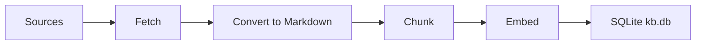

# pgEdge AI Knowledgebase Builder

The pgEdge AI Knowledgebase Builder ingests documentation from Git
repositories and local paths, then assembles a single SQLite database
of intelligently chunked text with vector embeddings. Downstream pgEdge
tools (such as the [pgEdge Postgres MCP
Server](https://github.com/pgEdge/pgedge-postgres-mcp) and the pgEdge
AI DBA Workbench) load the database to power semantic search across
PostgreSQL and pgEdge documentation.

**[Quick Start →](guide/quickstart.md)** - Build your first knowledgebase
in minutes.

## Key Features

The Knowledgebase Builder includes the following features:

- The builder ingests Markdown, HTML, reStructuredText, SGML, and
  DocBook XML documents from Git repositories or local paths.
- The builder normalises every input format to Markdown before
  chunking, so downstream consumers see a consistent representation.
- The builder uses an intelligent heading-aware chunker that
  preserves structural elements such as code blocks, tables, and
  lists.
- The builder generates embeddings with OpenAI, Voyage AI, or
  Ollama; you can enable any one or any combination.
- The builder supports incremental rebuilds; SHA256 checksums
  detect unchanged files and reuse existing chunks across versions.
- The builder retries transient embedding API errors with
  exponential backoff and a configurable retry limit.

How the build pipeline works:

1. The builder loads the YAML configuration and resolves API key files.

2. The builder fetches every source by cloning Git repositories or
   scanning local paths.

3. The converter normalises each supported document format into
   Markdown.

4. The chunker splits the Markdown at semantic boundaries while
   preserving structural elements.

5. The embedding generator calls each enabled provider to produce
   vectors for every chunk.

6. The database writer stores chunks and embeddings in an optimised
   SQLite database that downstream consumers query at runtime.

## User Guide

For users who run the builder:

- [Quick Start](guide/quickstart.md) describes installation and a
  first build.

- [Installation](guide/installation.md) covers prerequisites and
  install options.

- [Building a Knowledgebase](guide/building.md) walks through
  creating, configuring, and rebuilding a knowledgebase.

- [Configuring Sources](guide/sources.md) describes how to define
  Git and local documentation sources.

- [Configuring Embedding Providers](guide/embeddings.md) describes
  how to enable and tune OpenAI, Voyage AI, and Ollama.

- [Output Database Layout](guide/output-db.md) documents the SQLite
  schema produced by the builder.

- [Troubleshooting](guide/troubleshooting.md) collects fixes for
  common errors.

Reference:

- [Configuration File Reference](reference/config.md) lists every
  configuration field with examples.

For project contributors:

- [Development Setup](contributing/development.md) covers local
  development.

- [Architecture](contributing/architecture.md) describes the
  internal design.

- [Testing](contributing/testing.md) explains how the test suite is
  organised.

- [CI/CD](contributing/ci-cd.md) documents the automation pipelines.

## License

This project is licensed under the [PostgreSQL License](LICENSE.md).
